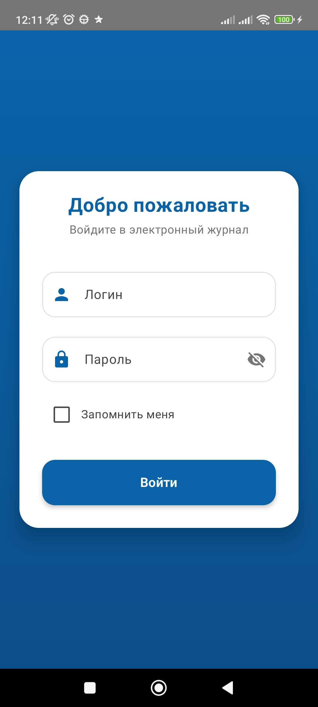

  

# IT TOP — Journal

Современное, быстрое и красивое приложение для просмотра расписания колледжа **IT TOP**, написанное полностью на **Jetpack Compose**.

---

## Особенности

- Авторизация с функцией "Запомнить меня"  
- Просмотр расписания по дню / неделе / месяцу  
- Pull-to-refresh и плавная навигация по датам  
- Автообновление через GitHub Releases (с принудительными обновлениями)  
- Современный Material You дизайн  
- 100% Kotlin + Compose — никакого XML

---

## Скриншоты

  
  &nbsp;&nbsp;&nbsp;&nbsp;
  

  
  &nbsp;&nbsp;&nbsp;&nbsp;
  

---

## Технологии

- Kotlin 1.9+
- Jetpack Compose + Material3
- Coroutines + Flow
- OkHttp + JSON
- GitHub Releases для автообновлений
- SharedPreferences (с планом перехода на DataStore)

---

## Установка (для студентов IT TOP)

1. Скачай последнюю версию по ссылке:  
   https://github.com/skanie/IT-TOP-Journal/releases/latest

2. Установи APK (разреши установку из неизвестных источников)

3. Войди под своими данными от journal.top-academy.ru

Готово! Расписание всегда под рукой.

---

## Автор

Разработано с любовью студентом колледжа IT TOP  
GitHub: [@skanie](https://github.com/skanie)

> Приложение неофициальное, но сделано лучше официального
